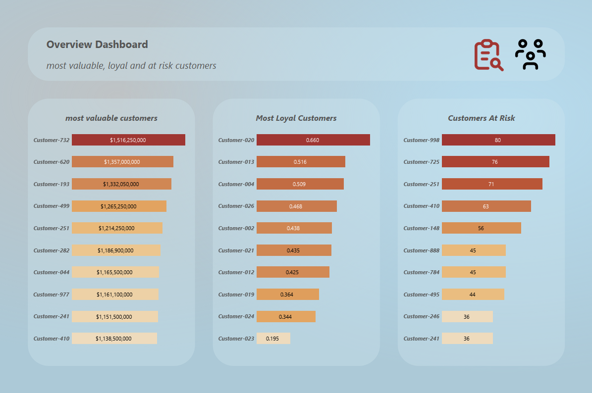
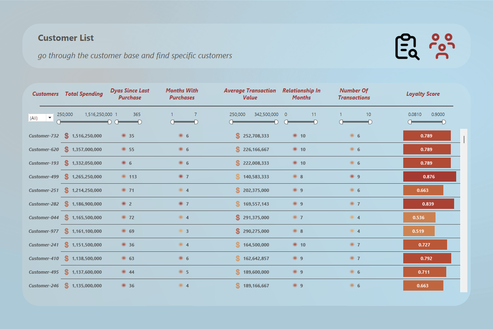

# Customer Analysis

SQL-based customer analysis identifying high-value, loyal, and at-risk customers from transaction history, visualized in a Tableau dashboard.

**[View the live dashboard on Tableau Public →](https://public.tableau.com/app/profile/arya.rezvani/viz/CustomerProject_17880046282590/CustomerOverview)**

## Business Question

> "We want to improve customer retention and make our marketing campaigns more targeted. Can you analyze our transaction history and identify our most valuable, most loyal, and potentially at-risk customers?"

This was broken down into three concrete questions:

1. **Who are our most valuable customers?** — total spending, number of transactions, average transaction value
2. **Who are our most loyal customers?** — transaction frequency, number of active months, length of relationship
3. **Which customers are at risk?** — days since last purchase, weighed against their historical frequency and value

## Dataset

A transaction-level sales dataset with the following fields:

`Transaction ID`, `Date`, `Product ID`, `Product Name`, `Product Category`, `Quantity`, `PPU` (price per unit), `Amount`, `Customer ID`, `Region`

*(Publicly available sample dataset used for portfolio purposes.)*

## Approach

All cleaning and analysis was done in **MySQL** ([`project_1.sql`](./project_1.sql)):

**1. Data cleaning**
- Renamed inconsistent column headers (e.g. `` `transaction id` `` → `transaction_id`)
- Built a `clean_sales_transactions` view that converts dates from text to proper `DATE` type and strips formatting from numeric fields (e.g. `1,250` → `1250`)

**2. Customer value**
- Aggregated total spending, transaction count, and average transaction value per customer

**3. Customer loyalty**
- Combined three signals — transaction count, number of distinct active months, and relationship length — into a single normalized **loyalty score**, so no one factor dominates
- Excluded customers inactive for 90+ days, since a customer who churned 8 months ago isn't meaningfully "loyal" today

**4. At-risk customers**
- Flagged customers with above-average purchase frequency who have gone quiet recently — these are the most actionable at-risk segment, since they were engaged and dropped off, rather than customers who were never very active to begin with

## Key Challenge

"High-value," "loyal," and "at-risk" aren't fields in the raw data — they had to be defined from behavior.

## Dashboard

The Tableau dashboard visualizes all three customer segments, letting stakeholders explore top customers by value, loyalty, and churn risk without needing to read SQL output directly.

## Tools

`MySQL` · `Tableau Public`

## What I'd Explore Next

- Cross-reference at-risk customers against product category to see if churn correlates with specific product lines
- Test whether a weighted loyalty score (vs. equal-weighted) better predicts retention
